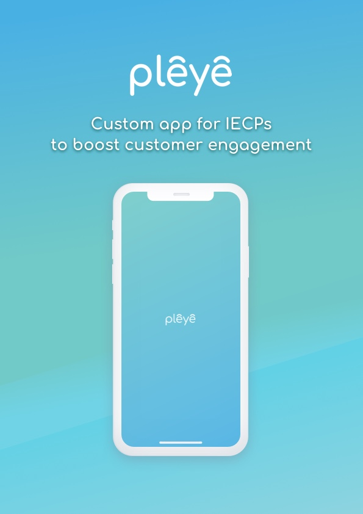

## Boost retention with engagement
We know many IECPs are struggling with losing sales in their optical business to online competitors, like Warby Parker, and big retailers like Costco and LensCrafters.

We created an app called Pleye. Pleye helps eye care professionals have their own app to boost customer engagement and increase return visits.

<picture>
    <source srcset="./assets/images/pleye_intro.webp" type="image/webp">
    <source srcset="./assets/images/pleye_intro.jpg" type="image/jpeg">
    
</picture>
 

## Transforms into your app
[Apply](https://www.blueprint-lab.com/qrcode) for a QR code that patients scan to change Pleye into your practice's custom app featuring your logo and colors.

<picture>
    <source data-srcset="./assets/images/pleye_qr.webp" type="image/webp">
    <source data-srcset="./assets/images/pleye_qr.jpg" type="image/jpeg">
    
</picture>
<picture>
    <source data-srcset="./assets/images/pleye_custom.webp" type="image/webp">
    <source data-srcset="./assets/images/pleye_custom.jpg" type="image/jpeg">
    
</picture>
 

## Share your info
Customers can easily call your office or look up your office hours and location. Let your patients know more about you and your staff by sharing your profiles.

<picture>
    <source data-srcset="./assets/images/pleye_office.webp" type="image/webp">
    <source data-srcset="./assets/images/pleye_office.jpg" type="image/jpeg">
    
</picture>
<picture>
    <source data-srcset="./assets/images/pleye_staff.webp" type="image/webp">
    <source data-srcset="./assets/images/pleye_staff.jpg" type="image/jpeg">
    
</picture>
 

## Future features
In the future, we will offer new modules such as virtual try on, easy appointment scheduling, and push notifications. Your patients can try new frames and sunglasses at home, then schedule an appointment to buy and fit them at your office. We'll send them notifications about upcoming appointments, events, and more.

<picture>
    <source data-srcset="./assets/images/pleye_experience.webp" type="image/webp">
    <source data-srcset="./assets/images/pleye_experience.jpg" type="image/jpeg">
    
</picture>
<picture>
    <source data-srcset="./assets/images/pleye_appointment.webp" type="image/webp">
    <source data-srcset="./assets/images/pleye_appointment.jpg" type="image/jpeg">
    
</picture>
 

## Try it now
Pleye is now available on the Apple App Store for iPhone.
1. First, apply for your own custom QR code.
2. Once we send you your QR code, you can have your patients download Pleye and scan your QR code for your custom app.

<a class="button special small" href="./qrcode" title="Pleye Application Link" target="_blank">Apply for Pleye</a>

## Get early access
We need your knowledge and experience to help us deliver a great product for your business. Help us improve Pleye by giving us a few minutes to fill out an anonymous survey. If you write-in your email, you will receive early access to new feature demos like our AR lens experience, virtual try on, and easy appointment scheduling.

<a class="button special small" href="https://forms.gle/XkbuT4VsBCnZdheP7" title="Go to survey" target="_blank">Go to survey</a>